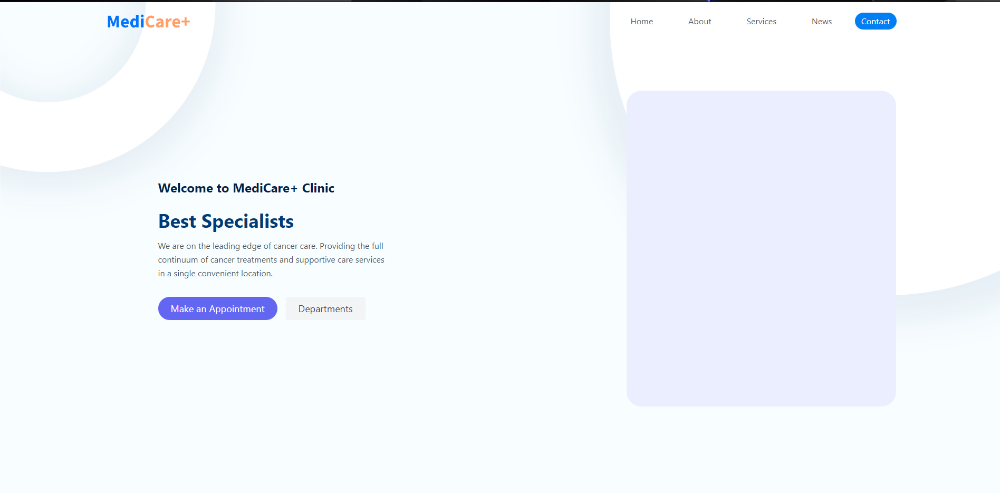
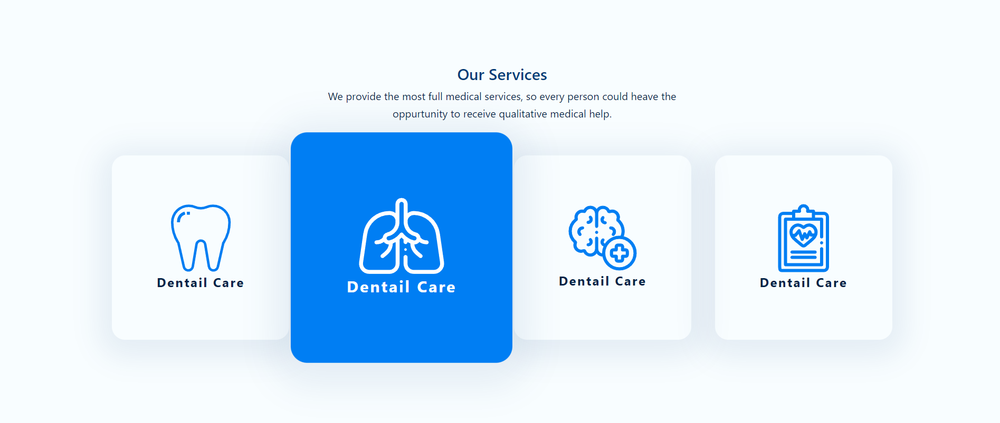
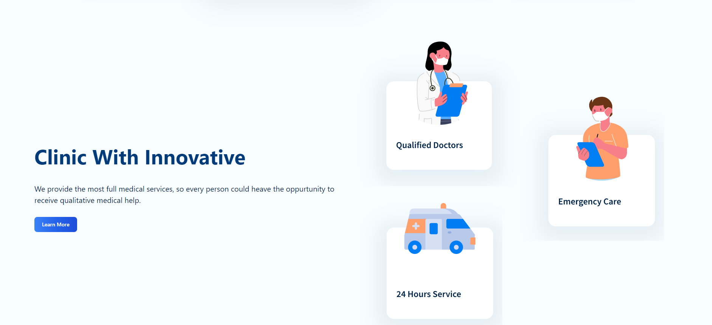
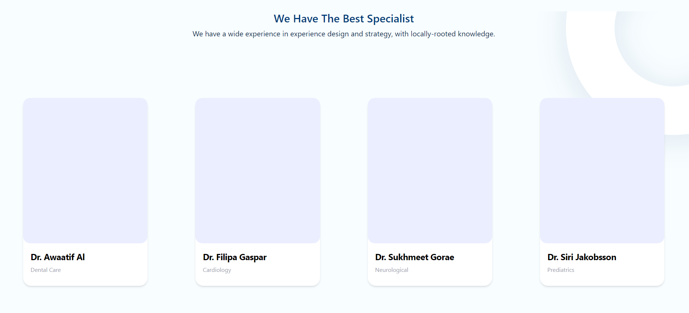
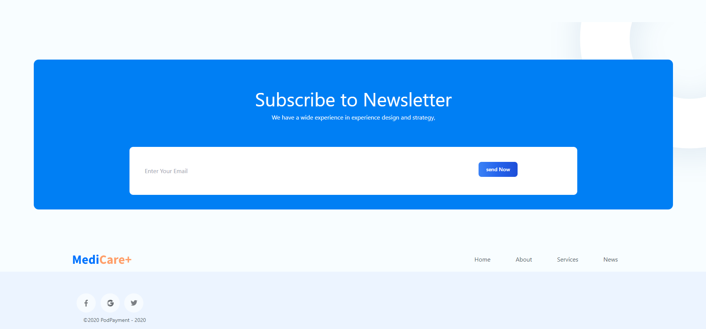

# Hospital Website for ByteQuest-Software-pvt-Ltd

This Project is Created for the ByteQuest-Software-pvt-Ltd, As a Assignement for Second round of React.Js position which is Availabe Right Now 

> Design Provided by ByteQuest-Software-pvt-Ltd

> We have used the Gatsby framwork with React as a library to make this as Close as we can

(I have never used Gatsby it's given as a Assignement so it's working model, but not a full blown Website)

# Time Taken

> This Took around 15 Hours of Time to create from the started from
> 22/10/2022 time 3:00pm to 23/10/2022 time 10.30pm

# Used Libaray

- Tailwind.css

  

- Swiper.js

  

- Axios

  

# Resources

[TailwindBlock](https://tailblocks.cc/) - Used to Create Block of Elements

[Npm](https://www.npmjs.com/)- Npm (Node package Manager ) is used to load up the Node modules

[Tailwind](https://tailwindcss.com/)- Tailwind css as Css framework

## Landing Page

## Services Section

## Innovative

## Specialist

## Customer

## Footer

> This project Was Greate to work on It's was my First time using
> Getsby so I just follow up the Documnent for Getsby and made it work
> I still don't know about the Getsby but I was able to create this Figma into a Website with just 2 days I hope We if will be sufficent

# Developer

 <h1>Shivampandey</h1>
 Frontend developer
 

 

